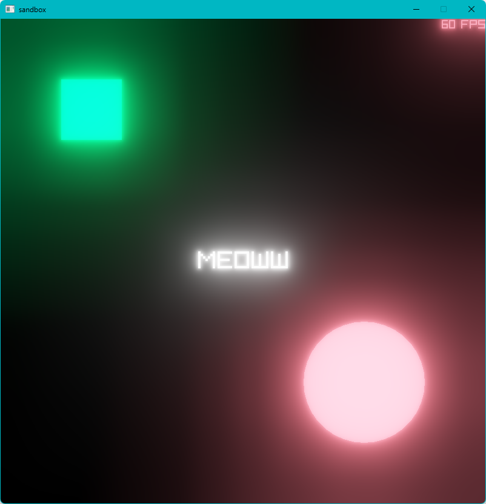

# Proper Bloom in RAYLIB

Using the method described in "Next Generation Post Processing in Call of Duty: Advanced Warfare" by Jorge Jimenez [1] and following along through the LearnOpenGL guest article "Physically Based Bloom." [2] This type of bloom is both computationally efficient and looks good for most uses.

## Demo

## Usage
Copy-paste the code into your project. `init_bloom()` and `do_bloom()` are the main functions for setting up and doing the passes. Feel free to make PR's to improve this. I haven't gotten around to making this anything official. Everything should be easy to hide away in some `bloom.cpp` file somewhere.

## Links
[1] https://www.iryoku.com/next-generation-post-processing-in-call-of-duty-advanced-warfare/

[2] https://learnopengl.com/Guest-Articles/2022/Phys.-Based-Bloom
